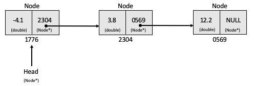

# Linked List

A linked list is a simple data structure. Unlike an array, elements are not stored at contiguous memory locations. Each element is its own separate object, generally referred to as a *node*. Each of these nodes contains a data value, and a pointer to the preceding node in the list. The exception to this is the tail node which has a `NULL` pointer. This is illustrated below.

 

 Figure 1: An example singly linked list with three nodes. Each node stores a double. 

 
This data structure has several advantages over arrays. The size of an array is fixed. Unless the maximum size of an array is known in advance, adding elements to it will occassionally require the entire array to be copied to a new memory location. This is expensive, and insertion is O(n). A linked list can use any available memory location in the heap and so insertion is O(1).

Linked lists are not suited to every task. Direct and random access is not possible. Accessing the nth element after the head requires sequentially traversing the pointers starting at the head. A consequence of this, for example, is that binary search is not possible.

## Problem

The task is to create a C++ implementation of a singly linked list. Each element of the list will store a value of type `double`. You will then use an Rcpp Module to expose the class to R. In case you become stuck, an example solution will be posted [here](../solutions/linkedlist/linkedlist.md) at some point during the course. However I strongly recommend you make as much progress as you can before looking at these!

1. Define a `Node` class with two attributes, one of type `double` and one pointer to another node (type `Node*`).

2. Define a `LinkedList` class. This should store a pointer to the head node, and have the following methods:

    - `LinkedList()`: a constructor initialising the head pointer to `NULL`
    - `head()`: returns the `double` value stores inside the head node.
    - `size()`: gives the total number of nodes in the list
    - `insert()`: takes a double and creates a new node, setting it as the head node
    - `remove()`: remove the head node from the list (remember to free memory on the heap!)
    - `print()`: a simple method to print the values in the list to the R console. `Rcpp::Rcout` may come in handy.

3. Write a simple Rcpp module to expose the `LinkedList` class, along with each of the aforementioned methods and constructor.

4. Load into an R environment using `Rcpp::sourceCpp()` and verify basic functionality.

5. **(Advanced) S4 dispatch:** todo.   

