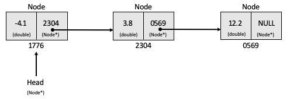

# Linked List

A linked list is a simple data structure. Unlike an array, elements are not stored at contiguous memory locations. Each element is its own separate object, generally referred to as a *node*. Each of these nodes contains a data value, and a pointer to the preceding node in the list. The exception to this is the tail node which has a `NULL` pointer. This is illustrated below.

 

 Figure 1: An example singly linked list with three nodes. Each node stores a double. 

 
This data structure has several advantages over arrays. The size of an array is fixed. Unless the maximum size of an array is known in advance, adding elements to it will occassionally require the entire array to be copied to a new memory location. This is expensive, and insertion is O(n). A linked list can use any available memory location in the heap and so insertion is O(1).

## Problem

The task is to create a C++ implementation of a singly linked list. Each element of the list will store a value of type `double`. You will then use Rcpp Modules to expose the class to R. In case you are stuck, you can find an example solution [here](linkedlist_solutions.md). I recommend giving it your best shot before looking at these!

1. Define a `Node` class with two attributes, one of type `double` and one pointer to another node (type `Node*`).

2. Define a `LinkedList` class with the following attributes and methods.

